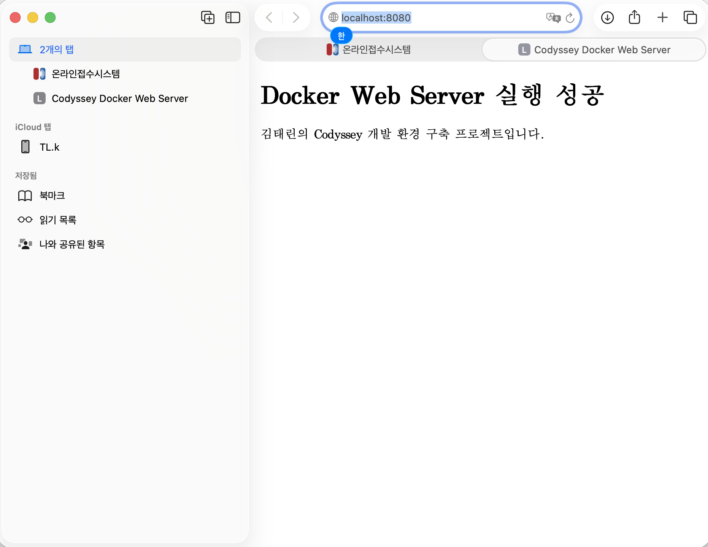
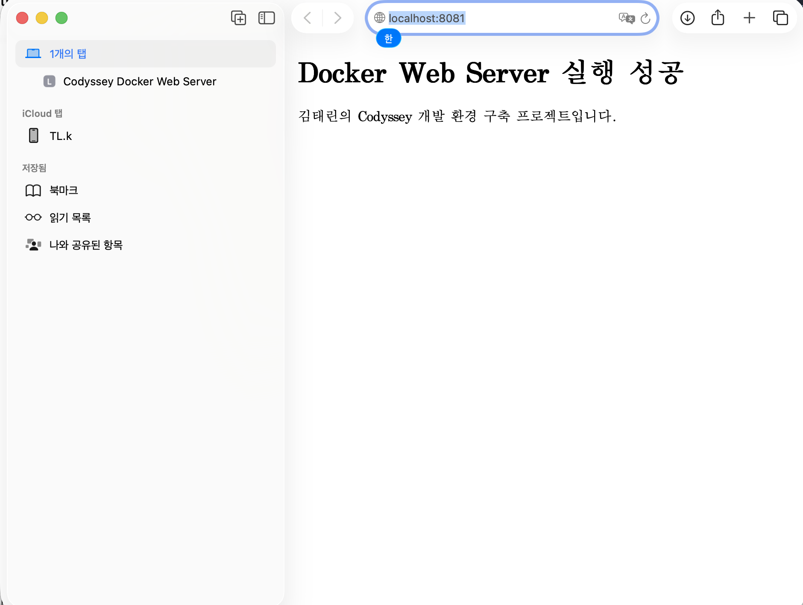
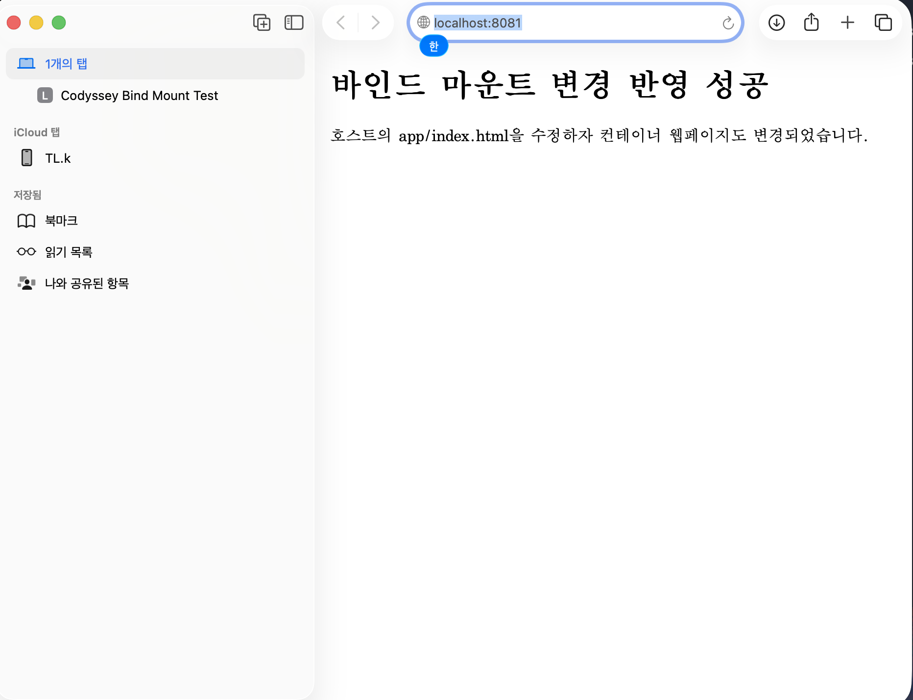
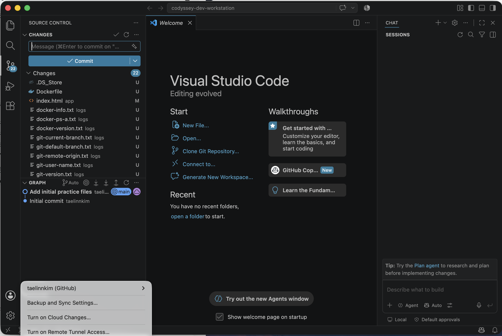

# 내 컴퓨터에 개발자용 '작업실' 꾸미기 — 개발 워크스테이션 구축

## 1. 프로젝트 개요

이 프로젝트는 로컬 개발 환경을 직접 손으로 세팅하며 **터미널(CLI) · Docker · Git/GitHub** 세 가지 핵심 도구를 다루는 것을 목표로 한다. 단순히 명령어를 따라 치는 데서 그치지 않고, 실행 결과(로그 · 접속 화면 · 데이터 유지 여부)로 각 단계를 직접 검증하여 "왜 이런 설계가 필요한지"를 설명 가능한 형태로 정리했다.

작업 환경은 서울캠퍼스 보안 정책상 `sudo` 권한 사용이 제한되는 점을 고려하여, Docker Desktop 대신 **OrbStack**을 사용해 별도 관리자 권한 없이 컨테이너를 실행·관리했다.

- **저장소:** `https://github.com/taelinnkim/codyssey-dev-workstation`

---

## 2. 실행 환경

| 항목 | 값 |
|------|-----|
| OS | macOS 26.5.2 (Build 25F84) |
| Shell | `/bin/zsh` |
| Terminal | Apple_Terminal |
| 컨테이너 런타임 | OrbStack (Docker 엔진 내장) |
| Docker | 29.4.0, build 9d7ad9f |
| Git | 2.50.1 (Apple Git-155) |

```bash
$ sw_vers
ProductName:		macOS
ProductVersion:		26.5.2
BuildVersion:		25F84

$ printf 'Shell: %s\nTerminal: %s\n' "$SHELL" "$TERM_PROGRAM"
Shell: /bin/zsh
Terminal: Apple_Terminal

$ docker --version
Docker version 29.4.0, build 9d7ad9f

$ git --version
git version 2.50.1 (Apple Git-155)
```

> 원본 로그: `logs/os-version.txt`, `logs/shell-terminal.txt`, `logs/docker-version.txt`, `logs/git-version.txt`

---

## 3. 수행 항목 체크리스트

- [x] 터미널 기본 조작 (pwd / ls -la / mkdir / cd / touch / echo·cat / cp / mv / rm / rm -r)
- [x] 파일·디렉터리 권한 변경 실습 (변경 전/후 비교)
- [x] Docker 설치·데몬 점검 (`docker --version`, `docker info`)
- [x] hello-world 컨테이너 실행
- [x] Ubuntu 컨테이너 실행·진입·중지/재시작, attach와 exec 차이 관찰
- [x] Docker 기본 운영 (`docker images`, `docker ps -a`, `docker logs`, `docker stats`)
- [x] Dockerfile 기반 커스텀 이미지 빌드·실행
- [x] 포트 매핑 접속 (8080, 8081 — 2회)
- [x] 바인드 마운트 변경 반영 (호스트 수정 → 컨테이너 반영)
- [x] Docker 볼륨 영속성 (컨테이너 삭제 후에도 데이터 유지)
- [x] Git 사용자 정보·기본 브랜치 설정
- [x] GitHub 저장소 연동 및 VSCode 연동

---

## 4. 검증 방법 요약

| 수행 항목 | 검증 명령 | 증거 위치 |
|-----------|-----------|-----------|
| 터미널 기본 조작 | `pwd`, `ls -la`, `mkdir`, `cp`, `mv`, `rm -r` 등 | `logs/terminal-basic-commands.txt` |
| 권한 변경 | `chmod`, `ls -l`, `ls -ld` | `logs/permission-before-after.txt` |
| Docker 점검 | `docker --version`, `docker info` | `logs/docker-version.txt`, `logs/docker-info.txt` |
| hello-world | `docker run hello-world`, `docker logs` | `logs/docker-hello-world-logs.txt` |
| Ubuntu 컨테이너 | `docker exec`, `docker stop/start` | `logs/ubuntu-exec.txt` 외 |
| 이미지·컨테이너 운영 | `docker images`, `docker ps -a`, `docker stats` | `logs/docker-images.txt`, `logs/docker-ps-a.txt`, `logs/docker-stats.txt` |
| 커스텀 이미지 빌드 | `docker build` | `logs/docker-build.txt` |
| 웹 서버 로그 | `docker logs codyssey-web-container` | `logs/docker-web-server-logs.txt` |
| 포트 매핑 접속 | 브라우저 접속 (8080 / 8081) | `screenshots/port-mapping-success.png` |
| 바인드 마운트 | 호스트 파일 수정 후 재접속 | `screenshots/bind-mount-before.png`, `screenshots/bind-mount-after.png` |
| 볼륨 영속성 | 컨테이너 삭제 전/후 데이터 확인 | `logs/volume-before.txt`, `logs/volume-after.txt` |
| Git 설정 | `git config --list` | `logs/git-config-list.txt` |
| GitHub·VSCode 연동 | VSCode GitHub 로그인 | `screenshots/vscode-github-connected.png` |

---

## 5. 터미널 조작 로그

### 5-1. 기본 조작

작업 디렉터리에서 현재 위치 확인 → 숨김 파일 포함 목록 확인 → 디렉터리 생성·이동 → 빈 파일 생성 → 내용 생성·확인 → 복사 → 이름 변경 → 삭제까지 한 흐름으로 수행했다.

```bash
$ pwd
/Users/tl.k/codyssey/codyssey-dev-workstation

$ ls -la
total 32
drwxr-xr-x  11 tl.k  staff   352 ...
drwxr-xr-x  13 tl.k  staff   416 .git
drwxr-xr-x   3 tl.k  staff    96 app
-rw-r--r--   1 tl.k  staff    81 Dockerfile
drwxr-xr-x  32 tl.k  staff  1024 logs
drwxr-xr-x   3 tl.k  staff    96 permission-practice
-rw-r--r--   1 tl.k  staff   117 README.md
drwxr-xr-x   7 tl.k  staff   224 screenshots
drwxr-xr-x   4 tl.k  staff   128 terminal-practice

# 디렉터리 생성 (mkdir)
$ mkdir "$work"
생성됨: terminal-practice/command-log-demo-...

# 디렉터리 이동 (cd)
$ cd "$work"; pwd
/Users/tl.k/codyssey/codyssey-dev-workstation/terminal-practice/command-log-demo-...

# 빈 파일 생성 (touch)
$ touch empty.txt
-rw-r--r--  1 tl.k  staff  0  empty.txt

# 파일 생성 및 내용 확인 (echo, cat)
$ echo "terminal command practice" > original.txt
$ cat original.txt
terminal command practice

# 복사 (cp)
$ cp original.txt copied.txt

# 이동·이름 변경 (mv)
$ mv copied.txt renamed.txt

# 삭제 (rm) / 디렉터리 삭제 (rm -r)
$ rm renamed.txt
$ rm -r "$work"
삭제됨: terminal-practice/command-log-demo-...
```

> 전체 로그: `logs/terminal-basic-commands.txt`

### 5-2. 절대 경로와 상대 경로

- **절대 경로**는 루트(`/`)에서 시작하는 전체 경로다. 예: `/Users/tl.k/codyssey/codyssey-dev-workstation/app/index.html`
- **상대 경로**는 현재 작업 디렉터리를 기준으로 한 경로다. 위 파일을 프로젝트 루트에서 가리키면 `app/index.html`, 한 단계 위로 올라가려면 `../` 를 사용한다.
- 실제로 `cd ../..` 로 두 단계 상위 디렉터리로 이동했고, `mv "$(pwd)/app/index.html"` 처럼 절대 경로를 조합해 바인드 마운트 소스를 지정했다.

---

## 6. 권한 실습 (변경 전/후 비교)

파일 1개(`sample.txt`)와 디렉터리 1개(`permission-practice`)에 대해 권한을 변경하고 원상 복구했다.

```bash
=== 변경 전 ===
drwxr-xr-x  3 tl.k  staff  96  permission-practice          # 755
-rw-r--r--  1 tl.k  staff  20  permission-practice/sample.txt   # 644

=== 변경 후 ===
$ chmod 600 permission-practice/sample.txt
$ chmod 700 permission-practice
drwx------  3 tl.k  staff  96  permission-practice          # 700
-rw-------  1 tl.k  staff  20  permission-practice/sample.txt   # 600

=== 원상 복구 ===
$ chmod 644 permission-practice/sample.txt
$ chmod 755 permission-practice
drwxr-xr-x  3 tl.k  staff  96  permission-practice          # 755
-rw-r--r--  1 tl.k  staff  20  permission-practice/sample.txt   # 644
```

**권한 표기 해석**

`r`(읽기)=4, `w`(쓰기)=2, `x`(실행)=1 이며, 세 자리 숫자는 각각 소유자 / 그룹 / 기타 사용자의 권한 합을 뜻한다.

- **755** = `rwxr-xr-x` : 소유자는 읽기·쓰기·실행(4+2+1), 그룹과 기타는 읽기·실행(4+1). 디렉터리에 흔히 쓰며, 진입(`x`)과 목록 확인(`r`)은 열되 수정은 소유자만 가능하게 한다.
- **644** = `rw-r--r--` : 소유자는 읽기·쓰기(4+2), 그룹·기타는 읽기(4)만. 일반 파일 기본 권한이다.

> 원본 로그: `logs/permission-before-after.txt`

---

## 7. Docker 설치 및 기본 점검

```bash
$ docker --version
Docker version 29.4.0, build 9d7ad9f

$ docker info --format 'Server Version: {{.ServerVersion}}
Operating System: {{.OperatingSystem}}
Architecture: {{.Architecture}}
CPUs: {{.NCPU}}
Total Memory: {{.MemTotal}}
Containers: {{.Containers}}
Running Containers: {{.ContainersRunning}}
Stopped Containers: {{.ContainersStopped}}
Images: {{.Images}}'
Server Version: 29.4.0
Operating System: OrbStack
Architecture: aarch64
CPUs: 10
Total Memory: 12601012224
Containers: 5
Running Containers: 3
Stopped Containers: 2
Images: 6
```

`docker info` 의 `Operating System: OrbStack` 항목에서 데몬이 OrbStack 엔진 위에서 정상 동작 중임을 확인했다.

> 원본 로그: `logs/docker-version.txt`, `logs/docker-info.txt`

---

## 8. Docker 기본 운영 명령

```bash
# 이미지 목록
$ docker images
IMAGE                 ID             DISK USAGE   CONTENT SIZE
alpine:latest         28bd5fe8b56d       14.6MB         4.27MB
codyssey-web:latest   6394393ea228       93.2MB           26MB
hello-world:latest    c3cbe1cc1aa5       18.5kB         10.3kB
nginx:alpine          4a73073bd557       94.1MB         26.9MB
ubuntu:latest         3131b4cc82a7        178MB         44.4MB

# 실행 중 컨테이너
$ docker ps
CONTAINER ID   IMAGE          PORTS                     NAMES
3a1bb36bd96a   nginx:alpine   0.0.0.0:8081->80/tcp      codyssey-bind-container
8a10e382584d   codyssey-web   0.0.0.0:8080->80/tcp      codyssey-web-container
b393bab46717   ubuntu                                   ubuntu-practice

# 리소스 사용량
$ docker stats --no-stream
CONTAINER ID   NAME                      CPU %   MEM USAGE / LIMIT     MEM %
3a1bb36bd96a   codyssey-bind-container   0.00%   7.797MiB / 11.74GiB   0.06%
8a10e382584d   codyssey-web-container    0.00%   8.168MiB / 11.74GiB   0.07%
b393bab46717   ubuntu-practice           0.00%   664KiB  / 11.74GiB    0.01%
```

> 원본 로그: `logs/docker-images.txt`, `logs/docker-ps.txt`, `logs/docker-ps-a.txt`, `logs/docker-stats.txt`

---

## 9. 컨테이너 실행 실습

### 9-1. hello-world

```bash
$ docker run hello-world
Hello from Docker!
This message shows that your installation appears to be working correctly.
...
```

> 원본 로그: `logs/docker-hello-world-logs.txt`

### 9-2. Ubuntu 컨테이너 진입 및 명령 수행

```bash
$ docker run -dit --name ubuntu-practice ubuntu bash
$ docker exec ubuntu-practice bash -c 'pwd; ls; echo "hello from Ubuntu container"'
/
bin  boot  dev  etc  home ... usr  var
hello from Ubuntu container
```

### 9-3. attach와 exec의 차이 (직접 관찰)

- 컨테이너를 `docker run -dit` 로 백그라운드 실행하면, 메인 프로세스(`bash`)가 계속 살아 있어 컨테이너가 유지된다.
- `docker exec -it ... bash` 로 들어간 세션에서 `exit` 해도 **메인 프로세스는 그대로**이므로 컨테이너는 계속 `Up` 상태였다. exec는 실행 중인 컨테이너에 별도 프로세스를 붙였다 떼는 방식이기 때문이다.
- 반면 `docker stop` 을 하면 메인 프로세스가 종료되어 `Exited (137)` 상태로 바뀌었고, `docker start` 로 다시 살릴 수 있었다.

```bash
$ docker stop ubuntu-practice
$ docker ps -a --filter name=ubuntu-practice
... Exited (137) ...
$ docker start ubuntu-practice
... Up ...
```

> 원본 로그: `logs/ubuntu-exec.txt`, `logs/ubuntu-stop.txt`, `logs/ubuntu-start.txt`, `logs/ubuntu-stopped-state.txt`

---

## 10. Dockerfile 기반 커스텀 이미지

**선택한 방식: (A) 웹 서버 베이스 이미지(NGINX) + 정적 콘텐츠 교체**

### Dockerfile

```dockerfile
FROM nginx:alpine
COPY app/index.html /usr/share/nginx/html/index.html
EXPOSE 80
```

### 커스텀 포인트

| 항목 | 목적 |
|------|------|
| `FROM nginx:alpine` | 가볍고 검증된 웹 서버 베이스 이미지 사용 |
| `COPY app/index.html ...` | 기본 페이지를 프로젝트 소개 페이지로 교체 |
| `EXPOSE 80` | 컨테이너가 사용하는 포트를 명시적으로 문서화 |

### 빌드 및 실행

```bash
$ docker build -t codyssey-web .
...
 => => naming to docker.io/library/codyssey-web:latest

$ docker run -d --name codyssey-web-container -p 8080:80 codyssey-web
8a10e382584d...

$ docker ps
8a10e382584d   codyssey-web   ...   0.0.0.0:8080->80/tcp   codyssey-web-container
```

웹 서버 접근 로그에서 `GET / HTTP/1.1 200` 응답을 확인했다.

```
192.168.215.1 - - [30/Jul/2026:05:35:31 +0000] "GET / HTTP/1.1" 200 331 ...
```

> 원본 로그: `logs/docker-build.txt`, `logs/docker-web-server-logs.txt`

---

## 11. 포트 매핑 및 접속 증거

`-p <host_port>:<container_port>` 로 호스트 포트와 컨테이너 내부 포트를 연결했다. 포트 매핑이 필요한 이유는, 컨테이너는 격리된 네트워크 공간에서 실행되므로 호스트의 포트와 명시적으로 연결해 주어야만 외부(브라우저)에서 접근할 수 있기 때문이다.

- `8080:80` → `codyssey-web-container`
- `8081:80` → `codyssey-bind-container`

두 개의 서로 다른 호스트 포트로 접속을 확인했다.

**8080 포트 접속 화면(주소창 포함):**



8081 포트 접속 결과는 다음 바인드 마운트 변경 전·후 스크린샷에서 확인할 수 있다.

---

## 12. 바인드 마운트 변경 반영

호스트의 `app/index.html` 을 컨테이너 내부 경로에 바인드 마운트한 뒤, **호스트 파일을 수정하자 컨테이너 웹페이지도 즉시 반영**되는 것을 확인했다.

```bash
$ docker run -d --name codyssey-bind-container -p 8081:80 \
    --mount type=bind,source="$(pwd)/app/index.html",target=/usr/share/nginx/html/index.html,readonly \
    nginx:alpine
```

이후 호스트의 `app/index.html` 내용을 "바인드 마운트 변경 반영 성공" 문구로 수정하고 `http://localhost:8081` 을 새로고침하여 변경 전/후를 비교했다.

**변경 전:**



**변경 후:**



---

## 13. Docker 볼륨 영속성 검증

바인드 마운트가 호스트 파일과 실시간으로 연결되는 것과 달리, **Docker 볼륨은 Docker가 관리하는 영속 저장 공간**이다. 볼륨에 쓴 데이터는 컨테이너를 삭제해도 남는다는 점을 다음 절차로 증명했다.

```bash
# 1) 볼륨 생성
$ docker volume create codyssey-data

# 2) 첫 번째 컨테이너에서 볼륨에 파일 기록
$ docker run --name volume-test-before \
    --mount type=volume,source=codyssey-data,target=/data \
    alpine sh -c 'echo "Docker volume data survives container removal." > /data/volume-test.txt && cat /data/volume-test.txt'
Docker volume data survives container removal.

# 3) 삭제 전 상태 확인
$ docker ps -a --filter name=volume-test-before
29a1ab39bc19   alpine   ...   Exited (0)   volume-test-before

# 4) 컨테이너 삭제
$ docker rm volume-test-before
volume-test-before

$ docker ps -a --filter name=volume-test-before
(비어 있음 — 컨테이너 삭제 확인)

# 5) 같은 볼륨을 연결한 새 컨테이너로 데이터가 남아 있는지 확인
$ docker ps -a --filter name=volume-test-after
53da5196885f   alpine   "cat /data/volume-te…"   Exited (0)   volume-test-after
```

첫 번째 컨테이너를 삭제한 뒤 실행한 `volume-test-after` 컨테이너가 동일 볼륨에서 `volume-test.txt` 를 그대로 읽어냈다. 즉 **컨테이너의 수명과 볼륨 데이터의 수명이 분리**되어 있음을 확인했다.

> 원본 로그: `logs/volume-before.txt`, `logs/volume-after.txt`, `logs/volume-container-before.txt`, `logs/volume-container-after-removal.txt`, `logs/volume-container-after.txt`

---

## 14. Git 설정 및 GitHub / VSCode 연동

### Git 설정

```bash
$ git config --global user.name "taelinnkim"
$ git config --global user.email "***@***"        # 마스킹
$ git config --global init.defaultBranch main

$ git config --list
credential.helper=osxkeychain
init.defaultbranch=main
user.name=taelinnkim
user.email=[masked]
remote.origin.url=https://github.com/taelinnkim/codyssey-dev-workstation.git
branch.main.remote=origin
branch.main.merge=refs/heads/main
```

**Git과 GitHub의 역할 차이**

- **Git**은 내 컴퓨터(로컬)에서 변경 이력을 기록·관리하는 **버전 관리 도구**다. `commit`, `branch` 등이 여기에 해당한다.
- **GitHub**은 그 Git 저장소를 원격에 호스팅하여 백업·공유·협업을 가능하게 하는 **원격 플랫폼**이다. `push`, `clone`, Pull Request 등이 여기에 해당한다.

### 초기 커밋 및 푸시

```bash
$ git add .
$ git commit -m "Add initial practice files"
[main 57ede0a] Add initial practice files
 6 files changed, 2 insertions(+)

$ git push
...
   42fca61..57ede0a  main -> main
```

### VSCode GitHub 연동



> 원본 로그: `logs/git-config-list.txt`, `logs/git-user-name.txt`, `logs/git-default-branch.txt`, `logs/git-current-branch.txt`, `logs/git-remote-origin.txt`

---

## 15. 트러블슈팅

### 트러블슈팅 1 — `git config user.name` 에 이메일을 잘못 입력

- **문제:** 사용자 정보를 설정하던 중 `git config --global user.name "storyfactory9@gmail.com"` 처럼 **이름 자리에 이메일을 입력**했다. `git config --global --list` 로 확인했을 때 `user.name` 이 이메일 값으로 잡혀 있었다.
- **원인 가설:** `user.name` 과 `user.email` 필드를 혼동함.
- **확인:** `git config --global --list` 출력을 다시 읽어 `user.name=storyfactory9@gmail.com` 인 것을 발견.
- **해결:** `user.name` 을 `taelinnkim` 으로, `user.email` 을 이메일로 각각 재설정하고 다시 `--list` 로 정상 반영을 확인.

### 트러블슈팅 2 — GitHub 푸시 시 비밀번호 인증 실패

- **문제:** `git push` 실행 시 아래 에러로 인증이 반복 실패했다.
  ```
  remote: Invalid username or token. Password authentication is not supported for Git operations.
  fatal: Authentication failed for 'https://github.com/taelinnkim/...'
  ```
- **원인 가설:** GitHub이 2021년부터 HTTPS Git 작업에 대해 **계정 비밀번호 인증을 폐지**했기 때문에, 비밀번호를 입력하면 실패한다.
- **확인:** 에러 메시지가 "Password authentication is not supported" 로, 비밀번호 방식 자체가 막혀 있음을 명시.
- **해결:** 비밀번호 대신 **Personal Access Token(PAT)** 을 발급해 인증에 사용하니 푸시가 성공했다 (`42fca61..57ede0a  main -> main`). 이후 `osxkeychain` credential helper에 저장되어 재입력이 불필요해졌다.

### 트러블슈팅 3 — `git clone` 시 저장소 소유자명 혼동 (보너스)

- **문제:** 처음 `git clone` 할 때 저장소 소유자 계정을 `taelinn` 등으로 잘못 지정하거나 username 프롬프트에 엉뚱한 값을 넣어 클론이 되지 않았다.
- **원인 가설:** 실제 GitHub 사용자명(`taelinnkim`)과 다른 값을 URL·프롬프트에 사용.
- **확인:** `ls -la` 로 클론된 파일이 없음을 확인.
- **해결:** 올바른 소유자명으로 `git clone https://github.com/taelinnkim/codyssey-dev-workstation.git` 을 실행하여 정상 클론했고, `git remote -v` 로 origin이 올바르게 연결됨을 확인했다.

---

## 16. 보안 및 개인정보 처리

- 문서·로그·설정 출력에서 이메일 주소는 `[masked]` 로 마스킹했다 (`git-config-list.txt` 생성 시 `sed` 로 자동 마스킹).
- 로그·스크린샷에 토큰, 비밀번호, 개인키가 포함되지 않도록 확인했다. (Personal Access Token은 어디에도 평문으로 기록하지 않음)
- `.gitignore` 에 `.DS_Store` 를 추가하여 불필요한 시스템 파일이 커밋되지 않도록 처리했다.

---

## 17. 디렉터리 구조

```
codyssey-dev-workstation/
├── README.md
├── Dockerfile
├── .gitignore
├── app/
│   └── index.html
├── logs/                # 명령어 실행 로그 (터미널/Docker/Git)
├── screenshots/         # 접속·연동 증거 스크린샷
├── permission-practice/ # 권한 실습
└── terminal-practice/   # 터미널 기본 조작 실습
```